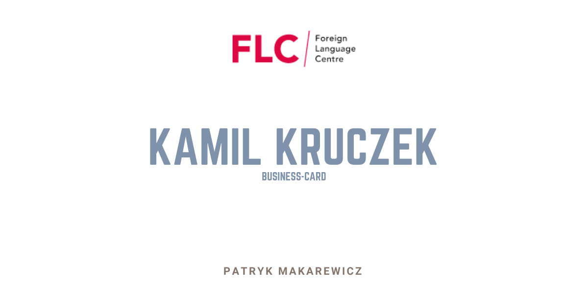

# General info

This is a business card of Kamil Kruczek the owner of FCL.

FLC Foreign Language Centre - The best language center.

## What I've used here:

✔ Semantic HTML5  
✔ CSS3 and SASS  
✔ BEM methodology  

## View:

To watch click [here]

## How to use it?

Clone it to your computer, go to the project directory in console and type `npm install`.

## Available script

`npm run start` - runs development mode

[here]: https://patryk-makarewicz.github.io/business-card-kamil-kruczek/
